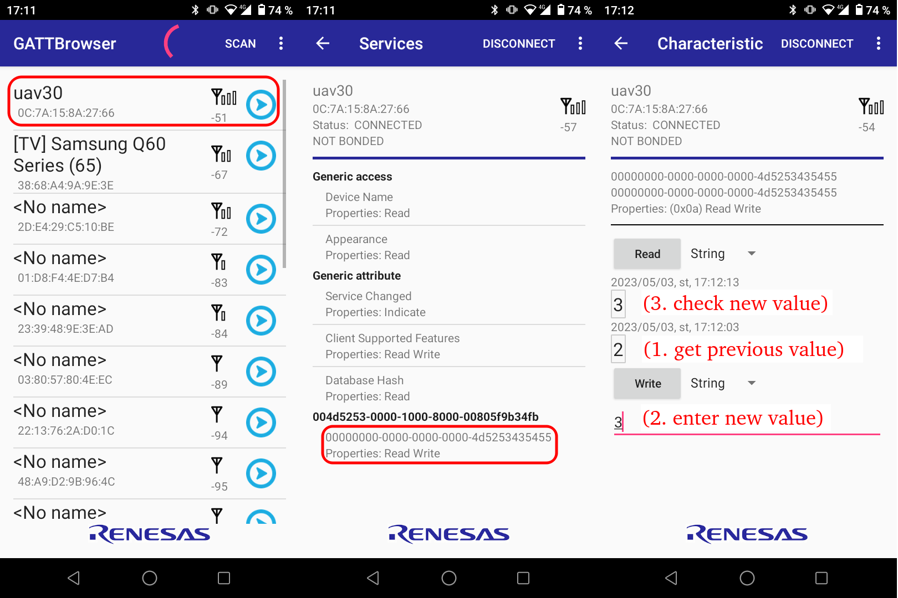

# MRS UAV Bluetooth Server Utility

This utility allows to change the currently used Wi-Fi network (`mrs_ctu_X` where X is a digit 0 to 8) by the UAV connected via Bluetooth. Currently, only a single Bluetooth client can be connected to the UAV at the same time.

## Example usage with Android devices
Using Android application [Renesas GATTBrowser](https://play.google.com/store/apps/details?id=com.renesas.ble.gattbrowser), the ASCII digit 0-8 can be read/set using a BLE service as shown in the image below.

