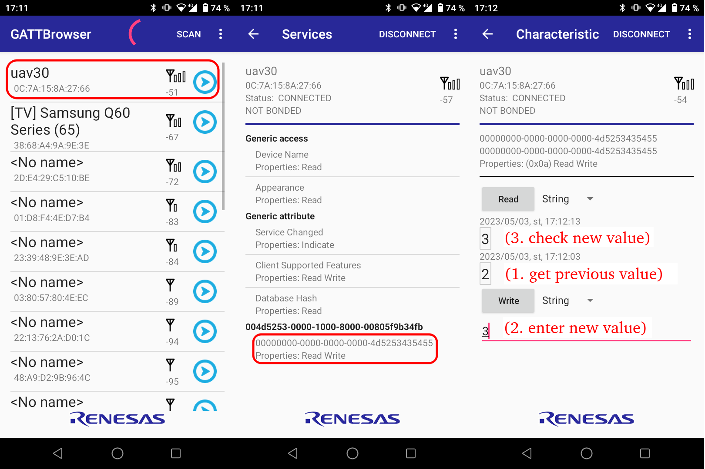

# mrs_uav_bluetooth

This repository now contains a ROS 2 reimplementation of the original MRS UAV Bluetooth service.

## Packages

- `mrs_uav_bluetooth`: Python ROS 2 package that runs the BLE node and also defines the custom ROS 2 messages and services used for scan results, GATT discovery, device control, reads, writes, notifications, and topic bridging.

## Running the node

Start the node directly:

```bash
ros2 run mrs_uav_bluetooth bluetooth_node
```

Example with common runtime options:

```bash
ros2 run mrs_uav_bluetooth bluetooth_node --ros-args \
  -p enable_server:=true \
  -p enable_scan:=true \
  -p auto_connect_uav_peers:=true \
  -p scan_mode:=le \
  -p verbose_log_file:=/tmp/mrs_uav_bluetooth.log
```

## Default BLE services

The local GATT server always exposes:

1. Wi-Fi service
	- Characteristic mirrors the currently active Wi-Fi SSID.
	- The Wi-Fi characteristic is writable, so generic BLE clients can change SSID by writing the target name directly to the characteristic.
	- The writable SSID descriptor still supports the same write flow for clients that prefer descriptor writes.
	- The writable password descriptor provides credentials for unknown networks when a direct connection attempt is needed.
	- The backend now prefers `nmcli` for reading the current SSID and performing live Wi-Fi connection changes. If that is not available or cannot be used, the node falls back to site scripts and then to direct netplan updates.
2. Time service
	- Characteristic and descriptor expose current system time as little-endian `uint64` nanoseconds.

All BLE UUIDs are generated from md5 hashes of symbolic names, so service calls can resolve human-readable names into the same stable UUIDs used on-air.

## ROS 2 behavior

- Publishes periodic BLE discovery snapshots with MACs, names, aliases, hostnames, RSSI, UUIDs, and connection state.
- Publishes remote GATT notification payloads on a dedicated ROS 2 topic.
- Automatically enables and republishes peer time notifications to `/ble/peers/<hostname>/time_ns` for connected UAV peers when enabled in launch.
- Provides ROS 2 services for connect, disconnect, pair, trust, remove, GATT enumeration, path lookup, read, write, notify, scan control, and BLE topic bridging.
- Supports launch-file driven auto-connect lists for BLE names and MAC addresses, plus optional `uavXX` peer auto-connect verification through the default time characteristic.

## Published topics

- `/ble/devices` (`mrs_uav_bluetooth/msg/BleDeviceArray`): periodic snapshot of discovered devices.
- `/ble/notifications` (`mrs_uav_bluetooth/msg/BleNotification`): raw remote GATT notifications received by the client side.
- `/ble/peers/<hostname>/time_ns` (`std_msgs/msg/UInt64`): republished peer time notifications for auto-connected UAV peers.

Examples:

```bash
ros2 topic echo /ble/devices
ros2 topic echo /ble/notifications
ros2 topic echo /ble/peers/uav37/time_ns
```

## Wi-Fi over BLE

Typical BLE-side flow for changing Wi-Fi:

1. Read the Wi-Fi characteristic to see the currently active SSID.
2. If the target network requires a password, write the password to the Wi-Fi password descriptor.
3. Write the target SSID either to the Wi-Fi characteristic or to the Wi-Fi SSID descriptor.

Runtime behavior:

- Current SSID lookup prefers `nmcli` so it reflects the live NetworkManager state instead of only the static netplan file.
- Wi-Fi changes prefer `nmcli device wifi connect <ssid>` with password when provided.
- If no password is provided and a site-specific script exists under `netplan_scripts_dir`, that script is still used.
- If `nmcli` is unavailable, the node falls back to updating the configured netplan file and running `netplan apply`.

## BLE topic bridge behavior

The `ble/configure_notification_bridge` service now supports equivalent bridge controls for both exported local topics and imported remote topics:

- `member_paths`: optional field projection such as `header.stamp`, `pose.position.x`, or `ranges[0]`. When provided, the bridge sends only those selected members over BLE as compact JSON instead of serializing the full ROS 2 message.
- `rate_hz`: optional BLE-side output rate limit. For exports, the node keeps only the latest topic sample and publishes it over BLE at the configured rate. For imports, characteristic notifications can be throttled before republising to ROS, and descriptor-based bridges poll at the requested rate.
- `transport_endpoint`: `characteristic` or `descriptor`. Export bridges publish the same payload through both the bridge characteristic value and the paired data descriptor, while import bridges can subscribe to notifications from the characteristic or poll the descriptor directly.

If a remote bridge publishes projected JSON payloads and metadata is temporarily unavailable, the importer falls back to the member keys carried inside the payload so direct-path connections remain decodable.

## ROS 2 service usage

The node exposes the following services.

### Device discovery and control

List all discovered devices:

```bash
ros2 service call /ble/list_devices mrs_uav_bluetooth/srv/ListDevices "{connected_only: false}"
```

List only connected devices:

```bash
ros2 service call /ble/list_devices mrs_uav_bluetooth/srv/ListDevices "{connected_only: true}"
```

Get a single device by MAC:

```bash
ros2 service call /ble/get_device mrs_uav_bluetooth/srv/GetDevice "{mac: 'AA:BB:CC:DD:EE:FF'}"
```

Connect to a device and wait for services to resolve:

```bash
ros2 service call /ble/connect_device mrs_uav_bluetooth/srv/ConnectDevice "{mac: 'AA:BB:CC:DD:EE:FF', timeout: 15.0, wait_for_services: true}"
```

Disconnect from a device:

```bash
ros2 service call /ble/disconnect_device mrs_uav_bluetooth/srv/DisconnectDevice "{mac: 'AA:BB:CC:DD:EE:FF', timeout: 10.0}"
```

Pair with a device and mark it trusted:

```bash
ros2 service call /ble/pair_device mrs_uav_bluetooth/srv/PairDevice "{mac: 'AA:BB:CC:DD:EE:FF', timeout: 30.0, trust_after_pair: true}"
```

Set trust explicitly:

```bash
ros2 service call /ble/set_device_trust mrs_uav_bluetooth/srv/SetDeviceTrust "{mac: 'AA:BB:CC:DD:EE:FF', trusted: true}"
```

Remove a remembered device from BlueZ:

```bash
ros2 service call /ble/remove_device mrs_uav_bluetooth/srv/RemoveDevice "{mac: 'AA:BB:CC:DD:EE:FF'}"
```

### GATT discovery

List services on a connected device:

```bash
ros2 service call /ble/list_gatt_services mrs_uav_bluetooth/srv/ListGattServices "{mac: 'AA:BB:CC:DD:EE:FF'}"
```

List characteristics on a connected device:

```bash
ros2 service call /ble/list_gatt_characteristics mrs_uav_bluetooth/srv/ListGattCharacteristics "{mac: 'AA:BB:CC:DD:EE:FF'}"
```

List descriptors on a connected device:

```bash
ros2 service call /ble/list_gatt_descriptors mrs_uav_bluetooth/srv/ListGattDescriptors "{mac: 'AA:BB:CC:DD:EE:FF', characteristic_path: ''}"
```

Find a characteristic path by UUID or symbolic name:

```bash
ros2 service call /ble/find_gatt_path mrs_uav_bluetooth/srv/FindGattPath "{mac: 'AA:BB:CC:DD:EE:FF', uuid: 'mrs_uav_bluetooth/time/ns', descriptor: false, characteristic_path: ''}"
```

Find a descriptor path by UUID within a characteristic:

```bash
ros2 service call /ble/find_gatt_path mrs_uav_bluetooth/srv/FindGattPath "{mac: 'AA:BB:CC:DD:EE:FF', uuid: 'mrs_uav_bluetooth/time/ns/value', descriptor: true, characteristic_path: '/org/bluez/hci0/dev_AA_BB_CC_DD_EE_FF/service0012/char0013'}"
```

### GATT read, write, and notifications

Read a characteristic value:

```bash
ros2 service call /ble/read_gatt_value mrs_uav_bluetooth/srv/ReadGattValue "{path: '/org/bluez/hci0/dev_AA_BB_CC_DD_EE_FF/service0012/char0013', descriptor: false}"
```

Read a descriptor value:

```bash
ros2 service call /ble/read_gatt_value mrs_uav_bluetooth/srv/ReadGattValue "{path: '/org/bluez/hci0/dev_AA_BB_CC_DD_EE_FF/service0012/char0013/desc0014', descriptor: true}"
```

Write a characteristic value with response:

```bash
ros2 service call /ble/write_gatt_value mrs_uav_bluetooth/srv/WriteGattValue "{path: '/org/bluez/hci0/dev_AA_BB_CC_DD_EE_FF/service0012/char0013', descriptor: false, value: [1, 2, 3, 4], with_response: true}"
```

Write a descriptor value:

```bash
ros2 service call /ble/write_gatt_value mrs_uav_bluetooth/srv/WriteGattValue "{path: '/org/bluez/hci0/dev_AA_BB_CC_DD_EE_FF/service0012/char0013/desc0014', descriptor: true, value: [109, 121, 95, 115, 115, 105, 100], with_response: false}"
```

Enable notifications on a characteristic:

```bash
ros2 service call /ble/set_notify mrs_uav_bluetooth/srv/SetNotify "{path: '/org/bluez/hci0/dev_AA_BB_CC_DD_EE_FF/service0012/char0013', enable: true}"
```

Disable notifications on a characteristic:

```bash
ros2 service call /ble/set_notify mrs_uav_bluetooth/srv/SetNotify "{path: '/org/bluez/hci0/dev_AA_BB_CC_DD_EE_FF/service0012/char0013', enable: false}"
```

### Scan control and runtime reload

Enable scanning:

```bash
ros2 service call /ble/set_scan_enabled mrs_uav_bluetooth/srv/SetScanEnabled "{enabled: true, transport: 'le'}"
```

Disable scanning:

```bash
ros2 service call /ble/set_scan_enabled mrs_uav_bluetooth/srv/SetScanEnabled "{enabled: false, transport: ''}"
```

Reload runtime configuration from the installed JSON config file:

```bash
ros2 service call /ble/reload_config std_srvs/srv/Trigger "{}"
```

### Topic bridge export examples

Export a local topic through a BLE characteristic. This example projects a few odometry fields into compact JSON and pushes them at 5 Hz:

```bash
ros2 service call /ble/configure_notification_bridge mrs_uav_bluetooth/srv/ConfigureNotificationBridge "{
	direction: 'export',
	mac: '',
	characteristic: 'telemetry_pose',
	topic_name: '/uav1/odom',
	message_type: 'nav_msgs/msg/Odometry',
	member_paths: ['header.stamp', 'pose.pose.position.x', 'pose.pose.position.y', 'pose.pose.position.z'],
	rate_hz: 5.0,
	transport_endpoint: 'characteristic',
	enable: true
}"
```

Publish test data into that exported bridge:

```bash
ros2 topic pub /uav1/odom nav_msgs/msg/Odometry "{
	header: {frame_id: 'map'},
	pose: {pose: {position: {x: 1.0, y: 2.0, z: 3.0}}}
}"
```

Export the same payload but have BLE clients poll the data descriptor instead of subscribing to characteristic notifications:

```bash
ros2 service call /ble/configure_notification_bridge mrs_uav_bluetooth/srv/ConfigureNotificationBridge "{
	direction: 'export',
	mac: '',
	characteristic: 'telemetry_pose_desc',
	topic_name: '/uav1/odom',
	message_type: 'nav_msgs/msg/Odometry',
	member_paths: ['pose.pose.position.x', 'pose.pose.position.y'],
	rate_hz: 2.0,
	transport_endpoint: 'descriptor',
	enable: true
}"
```

Remove an export bridge:

```bash
ros2 service call /ble/configure_notification_bridge mrs_uav_bluetooth/srv/ConfigureNotificationBridge "{
	direction: 'export',
	mac: '',
	characteristic: 'telemetry_pose',
	topic_name: '/uav1/odom',
	message_type: '',
	member_paths: [],
	rate_hz: 0.0,
	transport_endpoint: 'characteristic',
	enable: false
}"
```

### Topic bridge import examples

Import a remote BLE bridge carried by characteristic notifications and republish it as a ROS 2 topic:

```bash
ros2 service call /ble/configure_notification_bridge mrs_uav_bluetooth/srv/ConfigureNotificationBridge "{
	direction: 'import',
	mac: 'AA:BB:CC:DD:EE:FF',
	characteristic: 'telemetry_pose',
	topic_name: '/peer/uav1/pose_compact',
	message_type: 'std_msgs/msg/String',
	member_paths: [],
	rate_hz: 0.0,
	transport_endpoint: 'characteristic',
	enable: true
}"
```

Import a remote bridge by polling its data descriptor at 2 Hz:

```bash
ros2 service call /ble/configure_notification_bridge mrs_uav_bluetooth/srv/ConfigureNotificationBridge "{
	direction: 'import',
	mac: 'AA:BB:CC:DD:EE:FF',
	characteristic: 'telemetry_pose_desc',
	topic_name: '/peer/uav1/pose_polled',
	message_type: 'std_msgs/msg/String',
	member_paths: [],
	rate_hz: 2.0,
	transport_endpoint: 'descriptor',
	enable: true
}"
```

Observe the imported ROS topic:

```bash
ros2 topic echo /peer/uav1/pose_compact
ros2 topic echo /peer/uav1/pose_polled
```

Remove an import bridge:

```bash
ros2 service call /ble/configure_notification_bridge mrs_uav_bluetooth/srv/ConfigureNotificationBridge "{
	direction: 'import',
	mac: 'AA:BB:CC:DD:EE:FF',
	characteristic: 'telemetry_pose',
	topic_name: '/peer/uav1/pose_compact',
	message_type: '',
	member_paths: [],
	rate_hz: 0.0,
	transport_endpoint: 'characteristic',
	enable: false
}"
```

Bridge notes:

- `characteristic` is the bridge name, not necessarily a literal UUID. The node resolves that symbolic name into the deterministic BLE UUID used on air.
- Export bridges expose metadata descriptors for `topic`, `type`, `format`, `members`, and `rate_hz`, plus a data descriptor for polling.
- Import bridges can often leave `message_type` empty if the ROS graph already contains publishers or subscribers for the target topic type, but specifying it explicitly is safer in scripts.

## Legacy package

The original non-ROS Python service is preserved under `_old_package` for reference while the new ROS 2 packages are used for deployment.

## Example usage with Android devices

Using Android application [Renesas GATTBrowser](https://play.google.com/store/apps/details?id=com.renesas.ble.gattbrowser), the Wi-Fi service can be inspected and changed as shown below.

